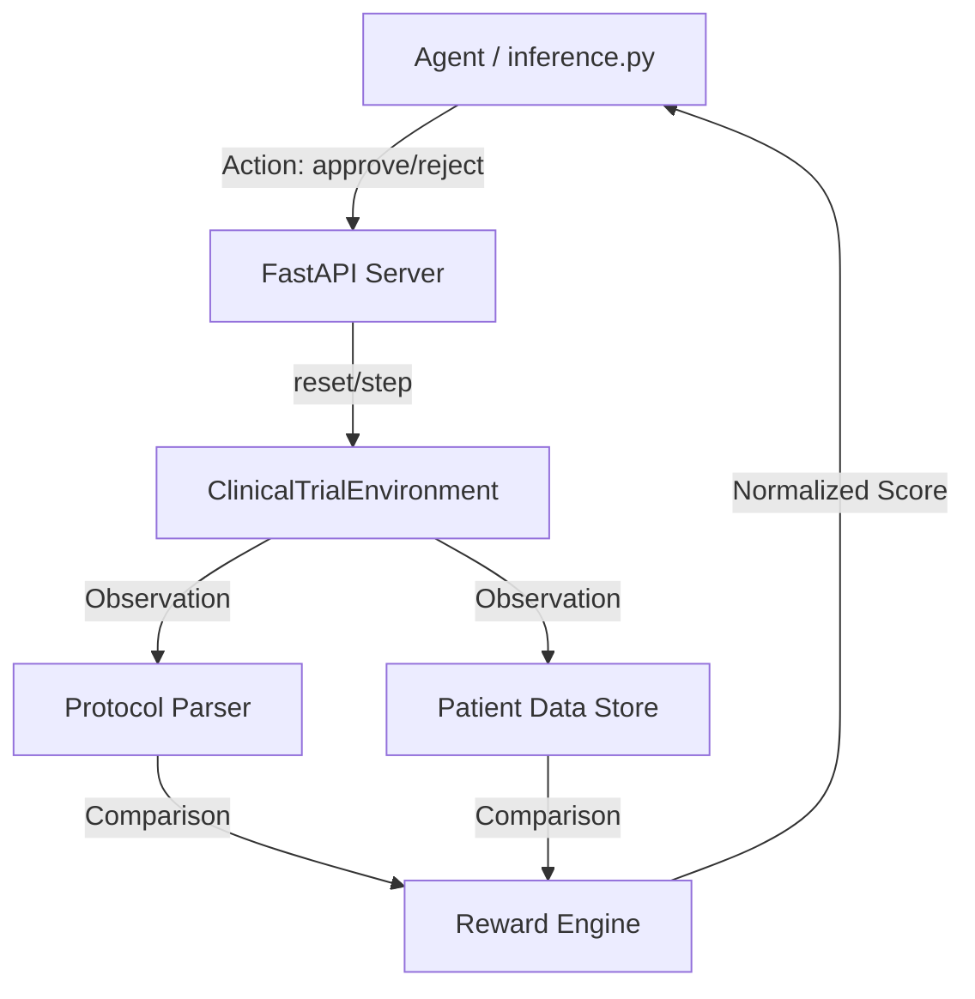

# 🧬 Clinical Trial Protocol Screener (OpenEnv)

[](https://github.com/OpenEnv/spec)
[](https://opensource.org/licenses/MIT)

A high-fidelity **OpenEnv** environment simulating the professional cognitive task of matching patients to clinical trials. Agents act as **Clinical Research Coordinators (CRCs)**, analyzing multi-dimensional medical data against strict Inclusion and Exclusion (I/E) criteria.

## 🚀 The Real-World Challenge: Screening

Clinical trial enrollment is the single greatest bottleneck in modern drug discovery. Manual patient screening is slow, error-prone, and consumes thousands of clinician hours. This environment provides a **benchmarking platform** for agents that can automate this high-stakes medical reasoning task.

### 🧠 The Cognitive Task
1.  **Protocol Inference**: Understanding the logical constraints (Age, Labs, Medications) of a trial.
2.  **Patient Matching**: Analyzing a patient's unstructured conditions and structured lab values.
3.  **Safety Logic**: Identifying critical "red flags" (Exclusion criteria) that outweigh potential matches.

---

## 🏗️ Technical Architecture

The environment is built using **FastAPI** and **Pydantic**, adhering strictly to the OpenEnv specification for remote agent interaction.



---

## 🎮 Action & Observation Spaces

### **Action Space (Typed Model: `Action`)**
The agent must provide a definitive decision for every patient:
- `approve`: All **Inclusion** rules are met; Zero **Exclusion** rules are violated.
- `reject`: One or more **Exclusion** rules found, or an **Inclusion** rule is missing.
- `request_more_info`: A critical dependency (e.g., a required lab) is missing from the record.

### **Observation Space (Typed Model: `Observation`)**
Each episode step provides the agent with a rich data context:
| Field | Type | Description |
| :--- | :--- | :--- |
| `protocol_name` | `str` | Clinical trial name (e.g., "Oncology Immunotherapy") |
| `patient.id` | `str` | Unique medical record identifier |
| `patient.age` | `int` | Age (Critical for pediatric/geriatric trials) |
| `patient.labs` | `Dict[str, float]` | Real laboratory values (AST, ALT, Creatinine, etc.) |
| `patient.conditions`| `List[str]` | ICD-10 styled medical conditions |
| `patient.meds` | `List[str]` | Current pharmacology (checking for contraindications) |

---

## 🏆 Task Complexity Matrix

| Task ID | Domain | Complexity | Decision Depth |
| :--- | :--- | :--- | :--- |
| **Easy** | Cardiology (Hypertension) | Low | 1-2 boolean checks (e.g., Condition = 'Hypertension'). |
| **Medium** | Renal/Cardiac (Heart Failure) | Moderate | 7+ variables including specific Age & Lab value bounds. |
| **Hard** | Oncology (Immunotherapy) | High | 15+ variables, lab-to-medication interactions, and multi-organ lab checks. |

---

## 📈 Reward Shaping & Scoring

The environment uses a **meaningful reward signal** to guide agent learning. Unlike binary environments, we reward partial reasoning:

### **Reward Calculation Table**
| Outcome | Base Reward | Justification |
| :--- | :---: | :--- |
| **Correct Match** | `1.0` | Agent correctly identified eligibility based on all rules. |
| **Partial (Metadata)** | `+0.25` | Reward for identifying a correctly signed consent form. |
| **Partial (Safety)** | `+0.25` | Reward for identifying a critical Exclusion (e.g., Diabetes). |
| **"Request info"** | `0.2` | Penalized compared to a match, but better than a blind 'approve' for safety. |
| **Incorrect Reject**| `0.0` | False negative (lost enrollment). |
| **Incorrect Approve**| `-0.5` | **Safety Violation**: Enrolled a dangerous mismatch (Strong Penalty). |

---

## 🛠️ Developer Setup

### **1. Environment Deployment**
The environment is containerized via Docker and served through Uvicorn.
```bash
# Local Setup
pip install -r requirements.txt
uvicorn server:app --host 0.0.0.0 --port 7860
# Local Setup
pip install -r requirements.txt
uvicorn server:app --host 0.0.0.0 --port 7860
```

### **2. Running Baseline Inference**
This evaluates the environment using a state-of-the-art LLM.
```bash
export OPENAI_API_KEY="your-key"
export MODEL_NAME="gpt-4o"
export API_BASE_URL="https://api.openai.com/v1"
python inference.py
```

### **3. Remote Protocol (FastAPI)**
The environment exposes the standard OpenEnv endpoints:
- `POST /reset`: Initialize a task (Easy/Medium/Hard).
- `POST /step`: Submit a decision for a patient.
- `GET /grader`: Retrieve the final deterministic accuracy score (0.0 - 1.0).

---

## 📜 Ethical Considerations
*This project is a simulation for AI benchmarking only. It should not be used for actual clinical diagnosis or real patient enrollment without human-in-the-loop validation and HIPAA-compliant data handling architectures.*
